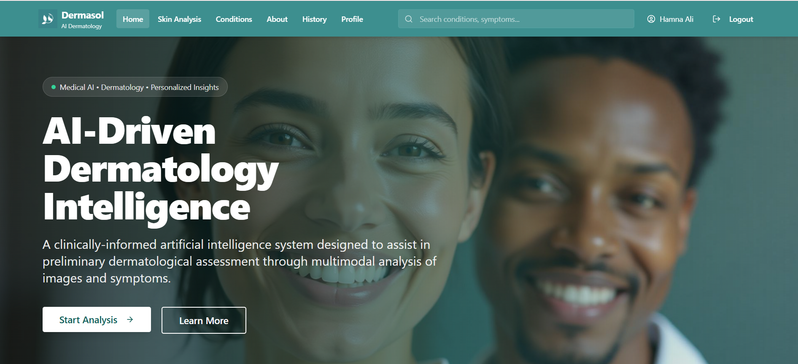
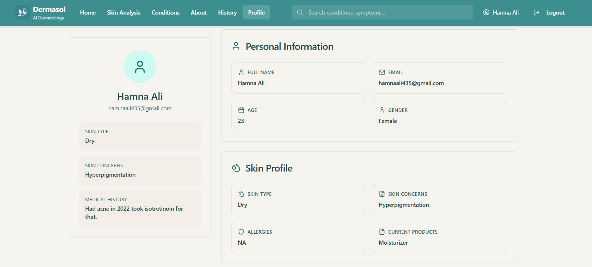
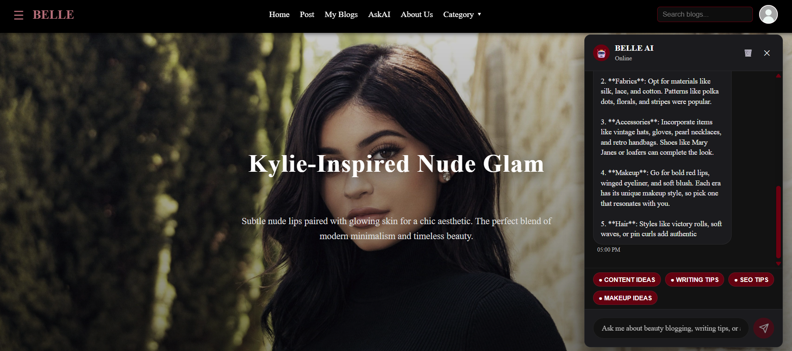
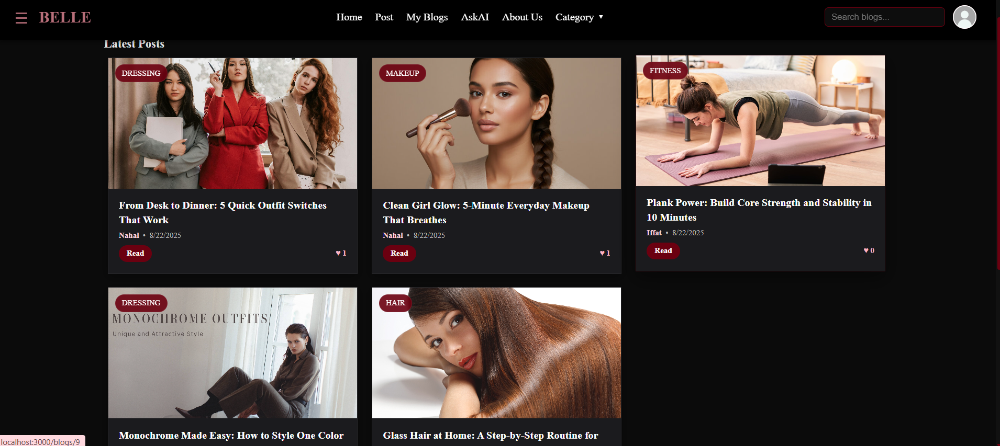
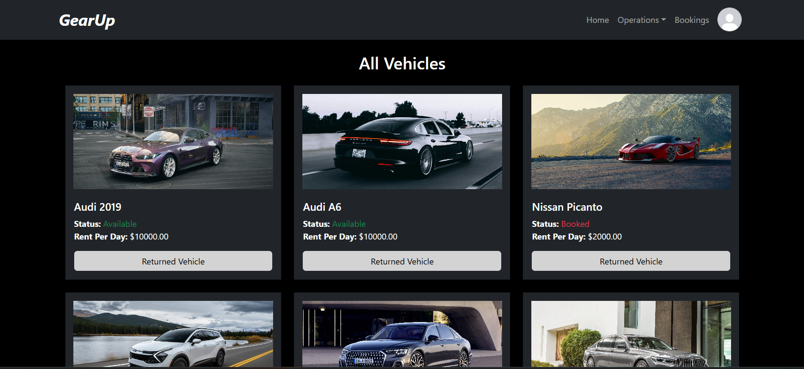
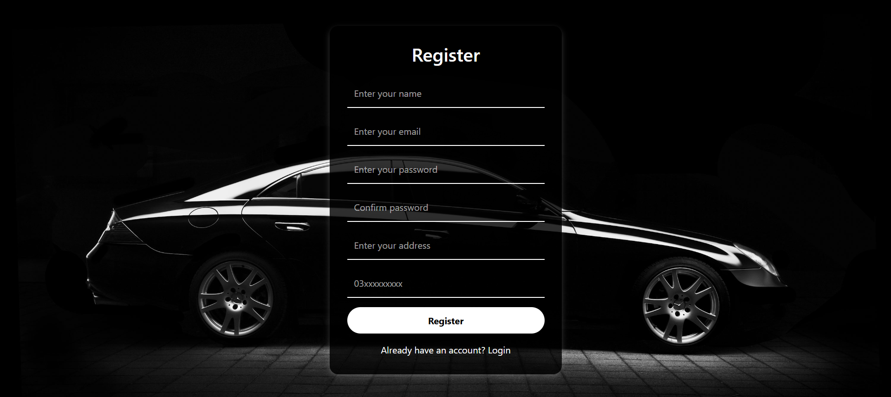

<h1 align="center">Ali Automations</h1>

Building scalable digital products, intelligent business systems, and modern web experiences for ambitious brands and growing businesses.

We specialize in custom web development, AI-integrated platforms, and high-performance applications engineered to strengthen digital presence, improve operational efficiency, and support long-term growth.

---

  
  

  
  

  
  

  
  

  
  

  
  

  
  

  
  

  

---

<h2 align="center">Featured Projects</h2>

 

<h3>DermaSol — AI Powered Dermatological Assistance</h3>

AI-powered dermatology intelligence platform designed for preliminary skin analysis, personalized insights, and modern healthcare experiences.

  

  

Python • Django • React • PostgreSQL • AI Integration

---

<!-- BELLE AI -->

<h3>BELLE An Intelligent Blogging Platform</h3>

Modern AI-enhanced blogging ecosystem focused on beauty, lifestyle, and intelligent content assistance with interactive AI-powered experiences.

  

  

React • Django • AI Chat Integration • PostgreSQL

---

<!-- GEARUP -->

<h3>GearUp — Vehicle Rental Management System</h3>

Premium vehicle rental and fleet management platform designed for booking operations, inventory handling, and customer management.

  

  

Django • PostgreSQL • Authentication • Dashboard Systems

  

---

  

  

  

---

  

---

<picture>
  <source media="(prefers-color-scheme: dark)" srcset="https://raw.githubusercontent.com/ali-automations-inc/ali-automations-inc/pacman-output/pacman-contribution-graph-dark.svg">

  

</picture>
